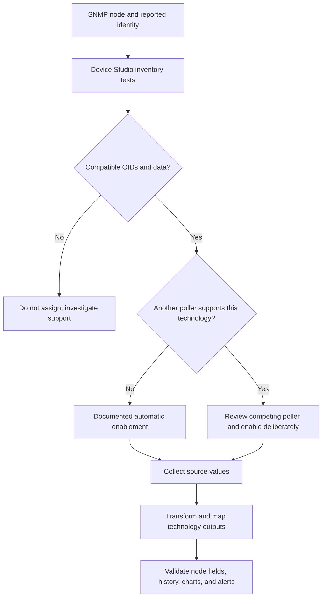

# Device Studio: matching, output contracts, and twelve-poller audit

Device Studio supplies replacement collectors for defined SolarWinds technologies.
A Node Details poller can improve identification fields; CPU and memory pollers feed
the platform's corresponding metrics. The important distinction is that identifying
a vendor, testing whether OIDs are available, selecting a collector, and enabling it
on a node are separate steps. A readable OID is not proof of the intended model,
correct units, or complete monitoring support.

This research uses the twelve supplied `.poller` files, current primary documentation,
and the repository's 2026.2 schema at commit
`e92f5b094cfe4a58c358e6d1c17e5cc2ba71c5ed`. Research date: 2026-09-18.
There were no live SNMP queries, imports, assignments, or formula-engine executions.
The exports do not establish the originating product release or current firmware
compatibility. Their author strings are artifact metadata, not independently verified identities.

## Deliverables and evidence

- [Machine-readable evidence](../../reference/device-poller-evidence/2026-09-18.json): file hashes, XML trees,
  embedded configuration XML, inventory checks, sources, formulas, mappings, and duplicates.
- [Complete field mappings](device-studio-export-mappings.md): every supplied file's
  source OIDs, operations, transformations, and outputs.
- [Read-only XML auditor](../../tools/audit_device_pollers.py): accepts one or more `.poller` files;
  no dependencies outside Python's standard library, network access, or formula evaluation.
- [Compatibility manifest template](../../reference/device-poller-evidence/compatibility-manifest-template.json): proposed
  sidecar evidence for model/firmware testing, not a SolarWinds import format.
- [Read-only SWQL inventory](../../reference/device-poller-evidence/inspection.swql): schema-validated queries
  to inspect identities and assignments on a customer system.

All twelve exports parsed. They contain eleven distinct PollerIDs, three TechnologyIDs,
48 inventory operations and 34 distinct source OIDs. All inventory operations are
`OidExists`. All parsed output and formula variable references resolve by name, and
the output table mapping resolves. These are structural checks, not semantic validation.
The auditor rejects DTD/entity declarations and malformed XML. It preserves raw nested
XML; it is not an import serializer or a complete expression-language validator.

## 1. Device identification and vendor lookup

Read the **instance** `1.3.6.1.2.1.1.2.0` to obtain `sysObjectID`. The result is itself an
OBJECT IDENTIFIER, normally under the enterprise tree `1.3.6.1.4.1`. That tree is not
the OID to query for `sysObjectID`. Keep the requested OID, returned type, and returned
value as separate evidence fields. [RFC 3418](https://www.rfc-editor.org/info/rfc3418/).

The historical Ubiquiti/Frogfoot article supplied by the owner conflates these levels
and includes both `100002` and `10002`. IANA currently lists
[10002 as Frogfoot Networks](https://www.iana.org/assignments/enterprise-numbers/?page=101)
and [41112 as Ubiquiti Networks, Inc.](https://www.iana.org/assignments/enterprise-numbers/?page=412).
That registry evidence does not prove what a particular device returns today.
The old article also describes a local discovery configuration file. Its present path,
contents, and update behavior were not verified; this audit does not recommend editing
that file or changing global vendor mappings.

The returned identifier describes the network-management subsystem; hardware brand,
operating system, SNMP agent, and enterprise registration need not be interchangeable.
This matters especially for pfSense on third-party hardware and for products with
historical vendor identifiers. A display correction should preserve the raw reported
identifier rather than substituting a brand name into it.

For standard scalar reads, use GET with the actual instance. GETNEXT from the object
root can retrieve its scalar instance, but requests the next accessible OID in order.
If the desired object is absent, the response can be another object. Record the response
OID and confirm it is the intended instance/subtree; a successful response alone is
insufficient. [RFC 3416](https://www.rfc-editor.org/rfc/rfc3416.html).

## 2. Matching, discovery, and activation



SolarWinds describes discovery opt-in as testing the poller on newly added nodes.
The test determines assignment eligibility, not universal replacement of existing
collectors. Its scan documentation says a matching poller is automatically enabled
when another poller does not already support that technology; otherwise manual
enablement is needed. Assignment scanning requires an Up SNMP node.
[Creation](https://documentation.solarwinds.com/en/success_center/npm/content/core-creating-device-studio-pollers-sw2534.htm),
[scanning](https://documentation.solarwinds.com/en/success_center/npm/content/core-scanning-monitored-objects-sw2528.htm),
[assignment](https://documentation.solarwinds.com/en/success_center/npm/content/core-assigning-pollers-sw2525.htm).

In these exports, `inventory` contains OID-existence operations with `Get` or `GetNext`.
There is **no explicit comparison of the returned sysObjectID to a vendor/model value**.
Reading `sysObjectID` as a polling source or output does not add such a comparison.
The Ubiquiti Vendor Name example checks only a standard wireless table instance.
Consequently, these files do not demonstrate a vendor whitelist mechanism.

The exact treatment of multiple inventory checks, optional sources, GETNEXT boundary
validation, discovery scheduling, and competing priorities needs target testing.
Do not invent an equality/prefix predicate in XML without a supported example or contract.
If available predicates cannot restrict a broad match sufficiently, use reviewed node
assignments and leave broad automatic discovery disabled.

All supplied outer `Enabled` values are true. There is no separate clearly named
discovery-opt-in field in these files. Do not assume a proven one-to-one mapping from
this field to the wizard checkbox, or confuse it with an enabled node assignment.
All Node Details examples have priority 50, scalar CPU/memory examples 500, and the
multi-CPU example 600. These observations do not establish ordering direction, ties,
or that changing a number overrides an active native collector.

## 3. Technology contracts and what they cannot add

SolarWinds documents Node Details, CPU & Memory, and Multi CPU & Memory authoring.
Node Details allows fixed or polled identity values. CPU data must be a percentage,
with a scalar for single CPU and rows for multiple CPUs. Memory is a separate quantity;
the CPU percentage guidance is not permission to put a memory percentage into a byte
output. VLAN/VRF pollers may appear in the UI without being authorable in Device Studio.
[Technology documentation](https://documentation.solarwinds.com/en/success_center/npm/content/core-device-studio-technologies.htm).

The following GUID associations are inferred from the supplied output shapes and
descriptions. Verify names through `Orion.DeviceStudio.Technologies` on the target;
they are not a promise that every future release uses this exact catalogue.

| Technology shape | Observed TechnologyID | Files |
|---|---|---:|
| Node Details | `7f842ebb-addd-4857-a10b-e7443cd97e32` | 7, including one duplicate |
| CPU & Memory | `56112b7c-d1d7-4dc9-ae57-398116061379` | 4 |
| Multi CPU & Memory | `ba9f862c-8249-4ac3-aa93-0aa1383acad8` | 1 |

Node Details has nine declared string outputs in these examples: Vendor, MachineType,
IOSVersion, IOSImage, Contact, Location, SysName, SysObjectId, and Description.
`IOSVersion` and `IOSImage` are historical field names also used for non-Cisco products.
Eight are marked optional; SysObjectId is not. Some optional outputs have no Mapping
element at all. Preserve absent mappings instead of converting them to empty strings;
whether the existing node field survives or is cleared is a live acceptance test.

CPU/memory examples declare Used Memory and Free Memory as Double, plus CPU Load as
Integer. The multi-CPU poller maps a Processors table with a CPU Load column.
These are output contracts, not arbitrary metric labels. The NPM 2024.1 release notes
report added MAC-address polling for Node Details, which these older nine-field examples
do not demonstrate. Do not treat their field list as exhaustive across releases.
[Release notes](https://documentation.solarwinds.com/en/success_center/npm/content/release_notes/npm_2024-1_release_notes.htm).

 A Node Details poller for
an AP does not thereby create wireless-client, radio, or controller monitoring. A UPS
Node Details poller does not add battery/runtime telemetry. Use a suitable supported
monitoring mechanism for additional metrics.

The older owner-supplied UnDP article's CPU/memory-only statement is incomplete against
current Node Details documentation. Its format distinction remains useful: UnDP and
Device Studio are different systems. Reuse verified OID knowledge, not a renamed file.

## 4. Import format and parser design

Each file is a namespaced XML `Poller`, declaring UTF-8. Metadata includes PollerID,
TechnologyID, PollingMethod, Name, Description, Author, Vendor, Tags, Priority, Enabled,
and Version. Each has Version 2; its exact serialization-version semantics remain
unverified, and it is not evidence of a SolarWinds release. All outer Vendor fields
are empty even where the poller sets a nonempty Vendor output: those are different fields.

`Configs` contains serialized key/value entries for `inventory` and `polling`.
Their values are **XML documents escaped as text inside the outer XML**.
Decode with the XML parser once for the outer document, then parse the resulting value
as XML. Do not repeatedly HTML-unescape the complete file. The Brocade description
still contains literal `&amp;` after outer parsing; that is source content to preserve,
not a reason to globally decode again.

The polling document is a pipeline:

| Stage | Observed types | Role |
|---|---|---|
| DataSourceCreateConfig | SnmpGet, SnmpGetNext, SnmpGetTable | Named scalar sources or table columns |
| DataSourceTransformConfig | Expression | Named computed values, including constants |
| DataSourceOutputConfig | OutputProperty, OutputTable | Technology field names, mappings, types, optionality |

Preserve namespace URIs, `xsi:type` and its QName namespace bindings, ordering, unknown
fields/types, and raw source bytes. Prefix spelling can change meaning if a serializer
drops a declaration referenced only by an attribute value. A generic XML parse/print
is not proof of a safe import/export round trip. Build a namespace-aware working model
and test target re-export before calling a writer compatible.

Treat source names as identifiers, including spaces, hyphens, and historical misspellings.
For example, the Ubiquiti source `Ubuquiti` resolves because its Mapping uses that same
spelling. Renaming only one side breaks the dependency. Validate formula references,
output mappings, table mappings, name collisions, and dependency cycles before export.
The included auditor resolves names but does not prove type compatibility, execution
order, cycles, expression syntax, or exact runtime formula semantics.

Identity handling should distinguish identical repeat imports, intended updates, and
independent new pollers. Preserve a source identity for an intentional update; give an
independent fork a new PollerID after checking the target workflow. Keep TechnologyID
because it identifies the output contract. Do not regenerate all GUIDs indiscriminately.
Same-ID/different-content files must be flagged; different names or filenames do not
establish independence. Actual overwrite/version behavior remains a target test.

## 5. Findings by supplied poller

| File | Observed behavior | Reuse assessment |
|---|---|---|
| Fortigate E | Processor table; memory percentage and capacity; computes used/free bytes | Good structural multi-CPU example; verify supported processor rows and firmware |
| Ubiquiti Wireless APs | Nine reads, including fixed wireless row 3 and UniFi version; maps all Node Details fields | Useful detailed example, not proof of support for all APs or other UniFi families |
| Synology NAS | Model/version, static vendor, substring, upgrade-status description | Correct the enum interpretation and test version-string formats |
| Juniper J2320 | Mixes Juniper box description, standard system values, and software-table row 2 | Hard-coded table indices require target verification |
| Brocade VDX 6940 | CPU and memory percentages; total memory fixed at 6701156 | Do not generalize capacity or units from this constant |
| Socomec-UPS | Manufacturer mapped as model; trap identifier used for SysObjectId | Requires correction and a new device test before reuse |
| Ubiquiti Vendor Name | Static Vendor and static SysObjectId set to Ubiquiti | Preserve real sysObjectID instead; broad standard-OID existence match is risky |
| Ubiquiti Vendor Name (1) | Byte-identical to the preceding file, same PollerID | Deduplicate, not an independent variation |
| APRESIA_AEOS | CPU row 3, converts active/free memory page counts with KiloToByte | Conversion has vendor support; verify model/version and active-memory semantics |
| APRESIA_AMIOS | CPU read; both memory outputs are constant zero | CPU-only implementation with memory placeholders, not measured zero usage |
| ApresiaLight | CPU, used and total DRAM; computes free = total - used | Verify exact MIB units and snapshot consistency for the target |
| Sonicwall Details | Vendor/model/version with standard system fields; no IOSImage mapping | Useful Node Details structure; test blank-field behavior and firmware |

### Ubiquiti identifier corruption and duplicate identity

Both Vendor Name files share PollerID `03c50328-2821-4b38-82b7-09714846aebf` and the
same SHA-256. They map `SysObjectIdFormula1 = 'Ubiquiti'` to SysObjectId. It satisfies
the XML's String type but not the semantic expectation of an identifier. Poll the
reported `sysObjectID.0` for that output and keep the vendor display override separate.
The exact downstream effects on discovery or classification are untested; do not claim
that this static analysis proves a particular live outage.

Their only inventory check is GET on `1.2.840.10036.3.1.2.1.2.7`. The richer AP file
uses row 3 and GETNEXT on a related column. These fixed rows are not enterprise-vendor
predicates and may differ by model, radio layout, or firmware. The AP tags name
UAP-nanoHD and UAP-BeaconHD, but tags are not a compatibility test.

### Socomec: a notification is not a readable identity object

`1.3.6.1.2.1.33.2.4` is `upsTrapAlarmEntryRemoved`, a NOTIFICATION-TYPE in
[RFC 1628](https://www.rfc-editor.org/info/rfc1628/). The supplied poller uses GETNEXT
and maps its result to SysObjectId. This can fail or return an unrelated next object;
it does not collect the device's actual identifier. The manufacturer also maps to
MachineType rather than Vendor, with other optional fields unmapped. Start with real
system identity and UPS identification objects, then validate the exact SNMP-card firmware.

### Memory transformations must preserve meaning

Fortinet documents memory capacity in KB, memory use as a percentage, and processor
usage as a last-minute percentage. The export multiplies capacity by 1024 and splits
it by the utilization percentage; the table shape is consistent with multiple processors.
Check processor types and supported values, as not all rows need support the same
statistics. [Fortinet MIB reference](https://docs.fortinet.com/document/fortigate/7.6.0/fortigate-mib-information-overview/293724/fortigate-system-mibs).

Brocade calculates `(6701156/100)*usage` and its complement. Their sum is the constant
under real-number arithmetic. The file supplies no unit declaration or capacity read
that establishes what that number represents. Do not silently multiply by 1024 or assume
it is bytes; obtain the target MIB and CLI comparison. Integer-division semantics also
need testing in Device Studio, not in Python or SWQL.

APRESIA's AEOS 8.42 specification describes active virtual pages and free-list pages,
each 1,024 bytes. This supports the sample's KiloToByte conversion, but does not make
active virtual memory identical to every vendor's physical used-memory definition.
[APRESIA specification, printed pages 403–404](https://www.apresia.jp/products/ent/support/docs/MibSpec_AEOS8.42_TD61-7821.pdf).
The exact APRESIA_AMIOS, ApresiaLight, and Brocade MIB/firmware semantics were not
independently established in this audit. Preserve that boundary.

AMIOS's two zeros are authored constants. SolarWinds permits constants for CPU-only
devices, but documentation and dashboards must not represent them as measured free
and used memory. A zero total also needs explicit handling by percentage calculations.

### Synology: do not collapse unknown into healthy

The formula maps status 1 to upgrade available and every other value to latest version.
Synology defines 1 Available, 2 Unavailable, 3 Connecting, 4 Disconnected, and 5 Others.
Connecting/disconnected/other must not be reported as evidence of being current.
Unavailable is a report of no available upgrade, not proof of universal patch compliance.
[Synology MIB guide, PDF page 9](https://global.download.synology.com/download/Document/Software/DeveloperGuide/Firmware/DSM/All/enu/Synology_DiskStation_MIB_Guide.pdf).
The substring calculation also assumes at least three prefix characters; retain the raw
version and test short, changed, or unexpected formats before adopting that transform.

## 6. Formulas and preview behavior

Device Studio expressions are a separate language from SWQL and PowerShell.
KiloToByte/MegaToByte/GigaToByte use powers of 1024. Aggregations can convert table
columns into a scalar; for example, averaging per-core percentages differs from summing
them. Preserve a per-core table when that is the intended technology.
SubString, Replace, conditions, and Regex need exact target testing. The supplied files
show `If(...)`, multiplication, division, concatenation, and constants, but contain no
Regex or aggregation examples.

The formula documentation describes Regex limitations involving carriage returns,
backslash constructs, shorthand classes, and character-class conditions. Its description
of Truncate as rounding does not establish ties or negative-number behavior. Do not infer
general .NET regex compatibility or standard math semantics from the function names.
[Formula reference](https://documentation.solarwinds.com/en/success_center/npm/content/core-common-formulas-sw2531.htm).
The Get Type page mentions only five returned table values; verify preview versus actual
collection behavior with a device having more than five rows rather than treating that
sentence as a proven runtime ceiling.
[Get Type documentation](https://documentation.solarwinds.com/en/success_center/npm/content/core-snmp-get-type-sw2549.htm).

## 7. SWIS inspection and import/export boundary

The three Device Studio entities are queryable in the repository's 2026.2 contract and
declare no CRUD/import verbs. Use console creation/import for the established workflow.
That does not justify saying no related assignment automation can exist anywhere:
`Orion.TechnologyPollingAssignments` publishes enable/disable verbs, including
`EnableAssignmentsOnNetObjects(technologyPollingID, netObjectIDs)`, requiring admin.
The arguments are a string and an array of numbers. Application to a particular
Device Studio poller needs a verified bridge and live validation; no verb was invoked.

`Orion.DeviceStudio.Pollers.TechnologyPollingID` is the bridge candidate to
`Orion.TechnologyPolling.TechnologyPollingID`. Do not join their TechnologyID properties:
Device Studio uses a GUID, while technology polling uses a string identifier space.
The inspection queries retain pollers without a matching bridge via LEFT JOIN.

No Device Studio import/export verb was found in the repository's published 2026.2
verb catalogue, and the query entity does not expose the nested Configs payload needed
to reconstruct these exports. Exporting query rows to JSON is therefore an inventory
snapshot, not a portable `.poller` backup. Do not invent ImportPoller/ExportPoller calls,
substitute SCM's similarly named profile verbs, or write directly to the database.

SolarWinds documents UI import into the Local Poller Library, overwrite-or-new choices
for previously imported community pollers, and export of user-created pollers. Pollers
provided by SolarWinds have export restrictions. These UI choices do not establish API
semantics or exact same-ID conflict behavior for all file imports.
[Community poller import/export](https://documentation.solarwinds.com/en/success_center/orionplatform/content/core-thwack-community-pollers.htm).

On a different target release, inspect its live metadata before deciding whether a new
public API exists. The inspection file includes entity capabilities and matching verb
metadata, including IsInternal. Finding an internal website endpoint or internal verb
does not establish a supported SWIS contract. The current verified workflow is UI import
and export, SWIS inspection, and separately documented assignment verbs only after their
bridge and effects have been verified. Related guidance:
[Device Studio](device-studio.md) and [technology polling](technology-polling.md).

The lookup queries are bounded at TOP 1000. Page or narrow them when the estate exceeds
that size. Permissions can restrict visible rows. A successful query is not proof of
collection, and absence of a bridge row is not permission to invent an identifier.

## 8. Building Ubiquiti and pfSense support next

Build a model/firmware/SNMP-agent compatibility matrix before producing importable files.
Keep Node Details separate from CPU/memory, then address other telemetry with its
appropriate supported mechanism.

For **Ubiquiti**, distinguish UniFi APs, switches, gateways, airMAX, and EdgeOS instead
of using one vendor-wide assumption. Ubiquiti's current SNMP documentation identifies
unsupported models and warns its published MIB is incomplete. It links UI-MIB; the
attachment fetch did not succeed in this audit, so no new model-specific numeric OIDs
were verified from that file. Keep the old AP definitions as source examples, not a
current universal template.
[Ubiquiti SNMP guidance](https://help.ui.com/hc/en-us/articles/33502980942615-SNMP-Monitoring-in-UniFi-Network).

For **pfSense**, record CE/Plus, release, hardware/VM, and the active SNMP daemon.
Netgate documents built-in bsnmpd with optional Host Resources and UCD modules; Host
Resources depends on MibII. Its separate NET-SNMP package can expose a different
capability set and supports SNMPv3. Test what the chosen daemon actually returns,
rather than identifying pfSense solely from a generic FreeBSD or Net-SNMP enterprise ID.
[Built-in SNMP](https://docs.netgate.com/pfsense/en/latest/services/snmp.html),
[package catalogue](https://docs.netgate.com/pfsense/en/latest/packages/list.html?highlight=snmp).

Candidate standard CPU data is `hrProcessorLoad` at `1.3.6.1.2.1.25.3.3.1.2`, a table
of last-minute non-idle percentages. Do not substitute a load average for CPU percent.
For memory, inspect `hrStorageTable` at `1.3.6.1.2.1.25.2.3`: identify the RAM row by
type/description, retain its index, and combine allocation units, size, and used counts.
Never assume row 1 is RAM or sum disks and swap into physical memory. These are standard
MIB candidates, not verified support claims for the user's future target.
[RFC 2790](https://www.rfc-editor.org/rfc/rfc2790.html).

For a chosen, correctly identified storage row, the design arithmetic is:

```text
total_bytes = allocation_unit_bytes * size_units
used_bytes  = allocation_unit_bytes * used_units
free_bytes  = total_bytes - used_bytes
```

This is pseudocode, not a ready Device Studio formula. Table filtering, index alignment,
overflow, missing values, and the operating system's cache/accounting model need validation.

## 9. Evidence needed and acceptance matrix

For each target family, retain a redacted read-only walk from the SolarWinds polling path,
including requested/returned OIDs, ASN.1 types, scalar instances, table indices, errors,
firmware, SNMP daemon/version, and timestamp. Do not include community strings or SNMPv3
secrets. Collect standard system values, candidate CPU and memory subtrees, and exact
vendor identity/version branches. Compare samples with the device's own UI/CLI under
more than one load level.

| Test | Required outcome |
|---|---|
| Positive model and firmware | Inventory succeeds; each output has the expected meaning/type/unit |
| Negative neighboring model/vendor | Broad standard OIDs do not cause an unintended vendor override |
| Missing or denied OID | Failure is distinguished from zero, empty string, and a different GETNEXT result |
| Existing native poller | Discovery and manual activation behavior recorded; no assumed forced takeover |
| Competing custom poller | Priority, ties, active assignment, and rollback behavior tested |
| Optional unmapped field | Existing value retention/clearing confirmed after polling and rediscovery |
| CPU table >5 rows | Full runtime cardinality and row identities compared with preview |
| Memory arithmetic | Nonnegative values, plausible capacity, expected units, and intentional accounting definition |
| Identity | Real sysObjectID preserved; display overrides do not masquerade as raw identity |
| Reboot/firmware change | Hard-coded table indices and source format assumptions revalidated |
| Import/update/fork | Same-ID update and new-ID copy behavior tested; re-export preserves full configuration |
| Rollback | Prior poller and assignments restored; node fields and subsequent historical data checked |

Use three independent statuses in future AI-generated manifests: structural validation,
vendor/MIB semantic validation, and live target validation. The supplied files pass the
first level's limited checks; several have documented semantic concerns, and none was
live-validated here. That separation is the foundation for reusable device support.
